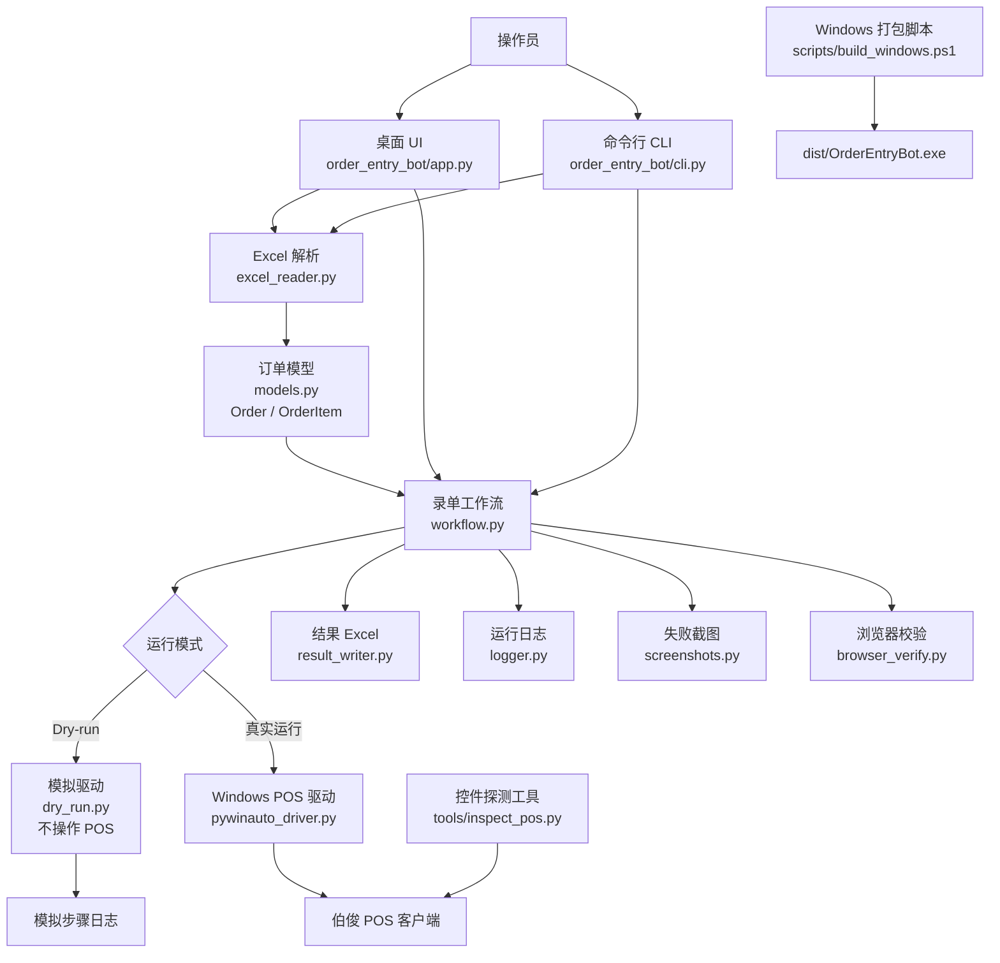
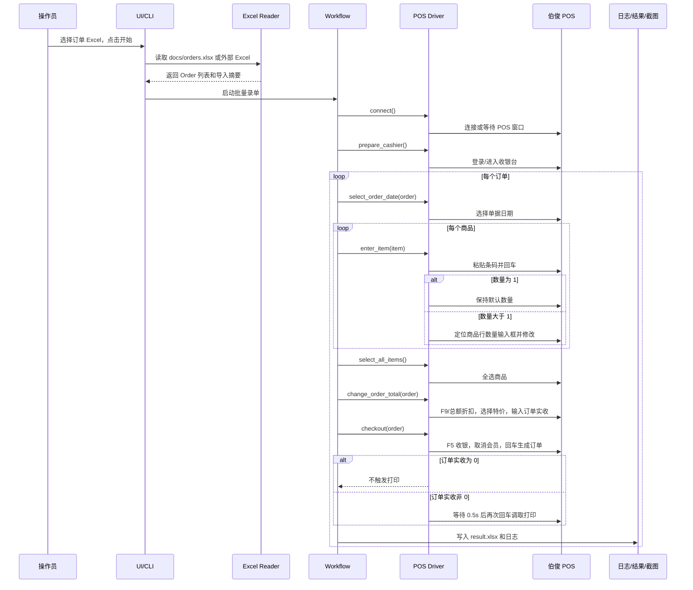
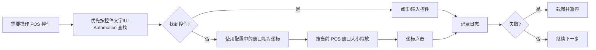

# 系统实现逻辑图

这份文档解释当前代码的整体实现逻辑。主要源码位于：

```text
order_entry_bot/
```

`order_entry_bot` 是 Python 包名，也是项目的主要代码目录。

## 总览



## 核心流程



## 模块职责

| 模块 | 职责 |
| --- | --- |
| `order_entry_bot/app.py` | Tkinter 桌面界面，提供文件选择、预览、开始、暂停、继续、停止 |
| `order_entry_bot/cli.py` | 命令行入口，支持 `preview`、`run`、`save-config` |
| `order_entry_bot/excel_reader.py` | 读取 Excel，按订单号分组商品行，校验字段和金额 |
| `order_entry_bot/models.py` | 定义订单、商品、结果、状态等数据结构 |
| `order_entry_bot/workflow.py` | 批量录单状态机，串联订单步骤、失败处理、暂停/停止 |
| `order_entry_bot/pos_driver/base.py` | POS 驱动接口定义 |
| `order_entry_bot/pos_driver/dry_run.py` | 本地模拟驱动，用于 macOS 或 Windows 上不操作 POS 的流程验证 |
| `order_entry_bot/pos_driver/pywinauto_driver.py` | Windows 真实 POS 自动化驱动 |
| `order_entry_bot/config.py` | 自动化配置、控件文字、fallback 坐标 |
| `order_entry_bot/result_writer.py` | 输出 `outputs/result.xlsx` |
| `order_entry_bot/logger.py` | 输出运行日志 |
| `order_entry_bot/screenshots.py` | 失败时截取整屏 |
| `order_entry_bot/browser_verify.py` | 打开浏览器校验地址，后续补充查询规则 |
| `tools/inspect_pos.py` | 在 Windows 上导出 POS 控件树，辅助校准控件定位 |
| `scripts/build_windows.ps1` | Windows 下安装依赖并打包 `.exe` |

## 为什么使用 `order_entry_bot` 这个目录名

当前目录结构是：

```text
order_entry_bot/
  app.py
  workflow.py
  ...
```

原因：

- `order_entry_bot` 表示 Python 包名，和项目功能对应。
- 打包、导入、命令行入口都依赖包名，例如 `order_entry_bot.cli:main`。
- 这种结构比把所有 `.py` 文件直接放在根目录下更清晰，也更适合后续测试和打包。

## 真实 POS 自动化策略



这个策略的原因是：录屏显示伯俊 POS 部分控件可识别，但商品表格、全选、数量编辑这类位置可能因 POS 版本或控件实现不同而不稳定。因此真实运行时需要先用 `tools/inspect_pos.py` 导出控件树，再按 Windows 实机情况校准配置。
